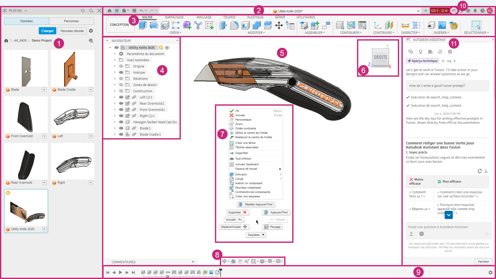
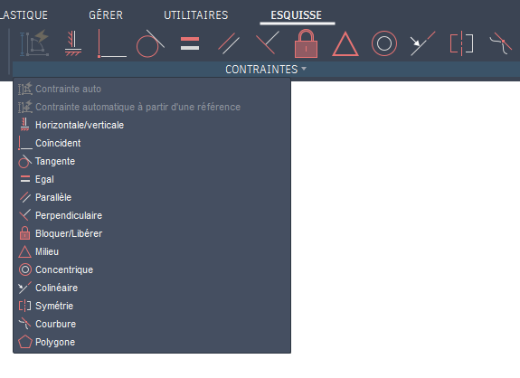

#1er pas sur Fusion 360

###Découverte de l'interface: <a href="https://help.autodesk.com/view/fusion360/FRA/?guid=GS-THE-FUSION-INTERFACE" target="_blank" rel="noopener noreferrer">Interface Fusion 360</a>   

###Les contraintes: <a href="https://help.autodesk.com/view/fusion360/FRA/?guid=SKT-CONSTRAINTS" target="_blank" rel="noopener noreferrer">Contraintes Fusion 360</a>   

p>

<iframe width="750" height="450" src="https://www.youtube.com/embed/O-NfMGtMJxA?si=Xvm2Gq5-31bMbgfl" title="Contrainte" frameborder="0" allow="accelerometer; autoplay; clipboard-write; encrypted-media; gyroscope; picture-in-picture; web-share" referrerpolicy="strict-origin-when-cross-origin" allowfullscreen></iframe>

###Documentations Fusion 360: <a href="https://help.autodesk.com/view/fusion360/FRA/" target="_blank" rel="noopener noreferrer">Fusion 360 Documentations</a>
