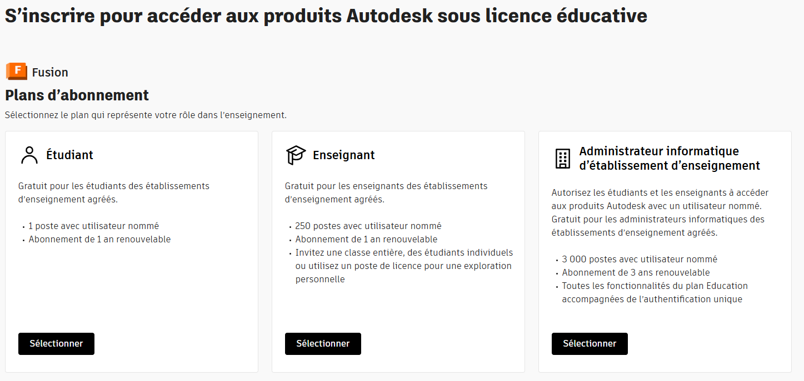
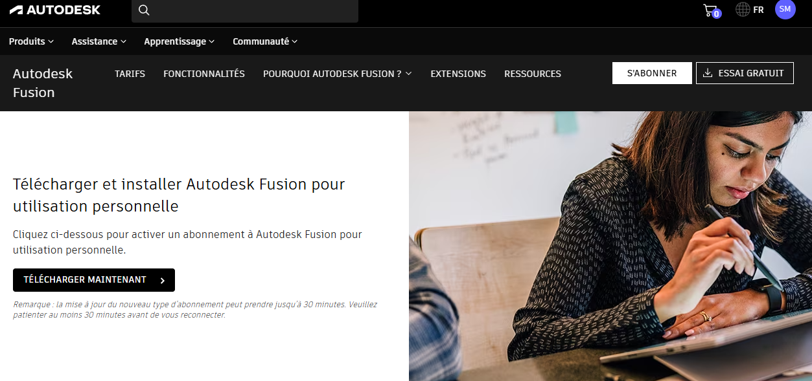

# Installation de Fusion 360 Education

<!-- ### I. Creation du compte éducation Fusion 360: -->

#### 1. Créer votre compte éducation Fusion 360 : <a href="https://www.autodesk.com/fr/education/edu-software/overview#FSN" target="_blank" rel="noopener noreferrer">Création compte Fusion 360 Education</a>   

Aprés quelques secondes, vous serez rediriger sur cette page : 

  

#### 2. Séléctioner votre stastus : Etudiant ou Enseignant    

#### 3. Remplir le formulaire en utilisant votre email etudiant.  
Cliquer sur continuer pour chaque etapes du formulaire.  
Pour la date d'optation du diplome, il saggi de la date d'optention envisagé.  
Pour le document justificatif, vous pouvez mettre votre attestation d'incription à l'ecole. 
Aprés quelques minutes vous recevrez un mail de confirmation.

#### 4. Connectez vous ensuite sur le site avec vos identifiants.

#### 5. Enfin télécharger et installer Fusion 360 : <a href="https://www.autodesk.com/fr/products/fusion-360/personal-download" target="_blank" rel="noopener noreferrer"> Téléchargement de Fusion 360 Education </a>   

  

###Vous pouvez maintenant continuer sur --> [1er pas sur Fusion 360](1er-pas-fusion-360.md)

<!-- https://dl.appstreaming.autodesk.com/production/installers/Fusion%20Admin%20Install.exe
https://dl.appstreaming.autodesk.com/production/installers/Autodesk%20Fusion%20Admin%20Install.pkg


## Line breaks

```
End a line with two spaces  
to create a line break.

Or use a blank line for a new paragraph.
``` -->
