# Démarrage rapide avec les imprimantes 3D
## I. Téléchargement du modèle 3D

Pour commencer, vous aurez besoin d'un modèle 3D.  
Vous pouvez télécharger ce fichier: [Flexagon.stl](stl/flexagon.stl)  
Ou sur l'un des sites de partage de modèles 3D: [Où trouver des modèles 3D ?](ou_trouver_des_models_3d.md) 
 
---
 
## II. Installation et configuration de Bambu Studio

#### 1. Télécharger et installer  <a href="https://bambulab.com/download" target="_blank" rel="noopener noreferrer"> Bambu Studio </a>  
A la première ouverture de Bambu Studio, vous serez invité à sélectionner différents paramètres. 
Laisser les paramètres par défaut et cliquer sur suivant jusqu'à arriver sur l'interface ci-dessous.  
 
   <!--#### 2. Sélectionner de la région

   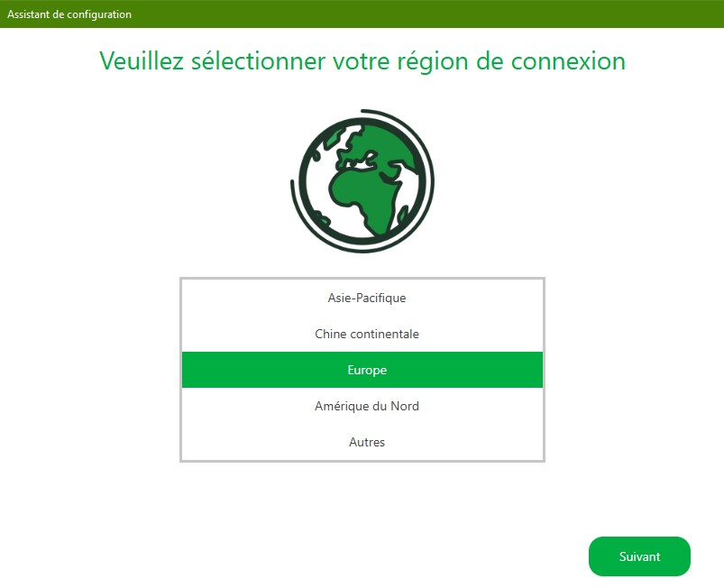
   
   ---
   

   #### 3.Sélection des l'imprimantes

   Cliquez sur **Tout effacer** puis sélectionner l'imprimante **X1 Carbon**.

   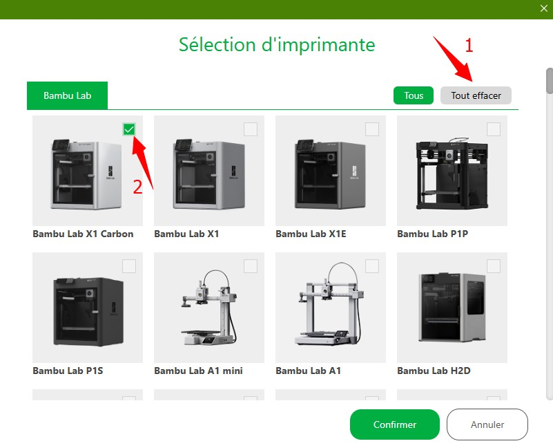
   
   ---
   

   #### 4.Sélection du filament

   Les filaments les plus courants sont déjà présélectionnés cliquer sur suivant.

   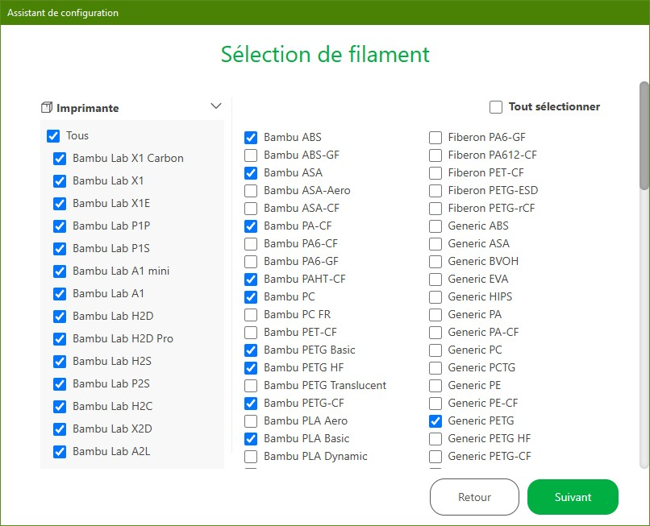
   
   ---
   

   #### 5. Ne pas installer le plugin réseau Bambu

   Décocher l'installation du plugin réseau et cliquer sur terminer. 

   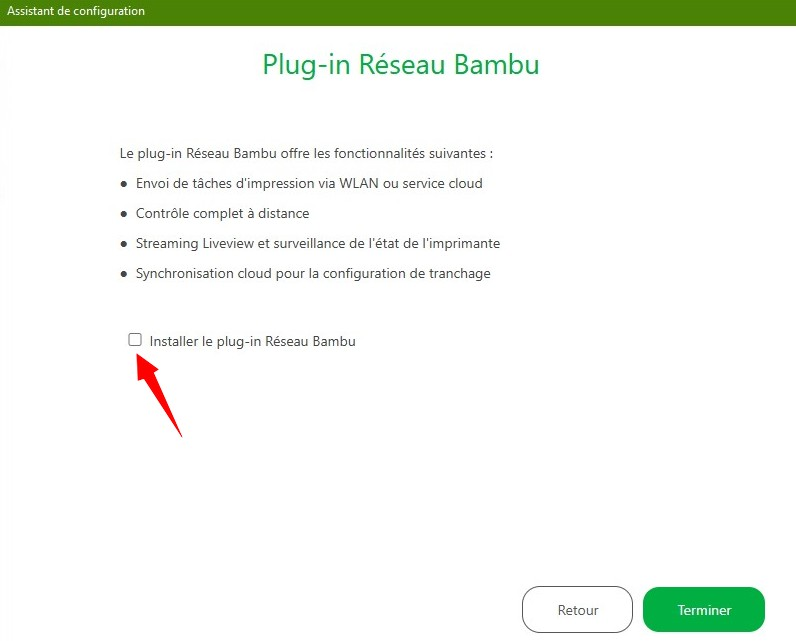
   
   ---

   ## Préparation de votre impression  -->

#### 2. Créer un nouveau projet

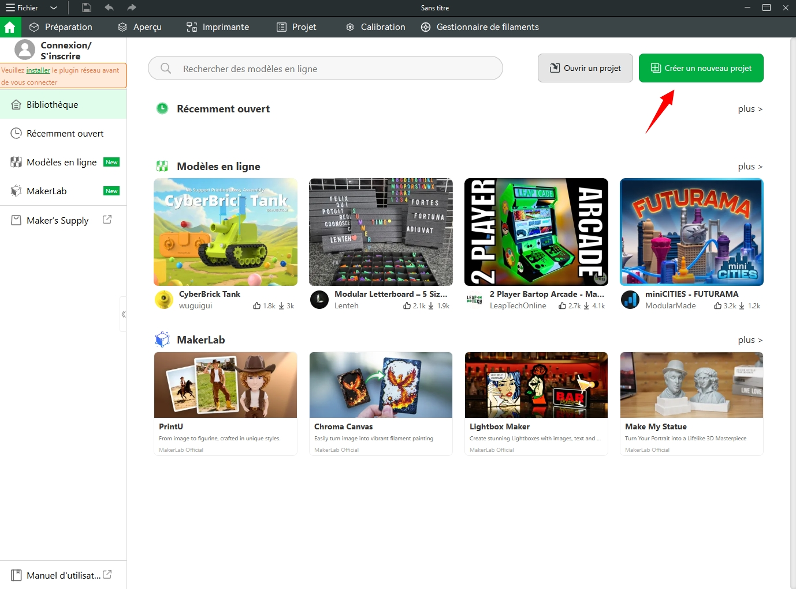

---

#### 3. Sélectionner la bonne imprimante 3D

Cliquer sur l'icône de l'imprimante 3D et sélectionner l'imprimante **X1 Carbon**.  

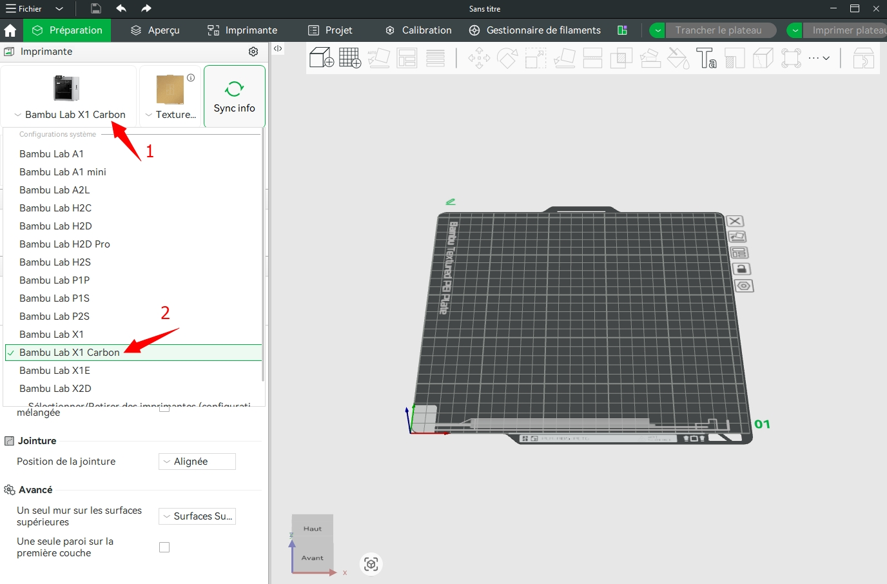

---
 
#### 4. Ajouter le modèle précédemment téléchargé 
Si ce n'est pas fait : [Téléchargement du modèle 3D](#itelechargement-du-modele-3d)

Dans la barre d'outils supérieure, cliquez sur l'icône **ajouter** pour importer le modèle 3D.  
Vous pouvez également faire un glisser-déposer.  
Les fichiers pris en charge sont .3mf .stl .stp .step .amf .obj.   

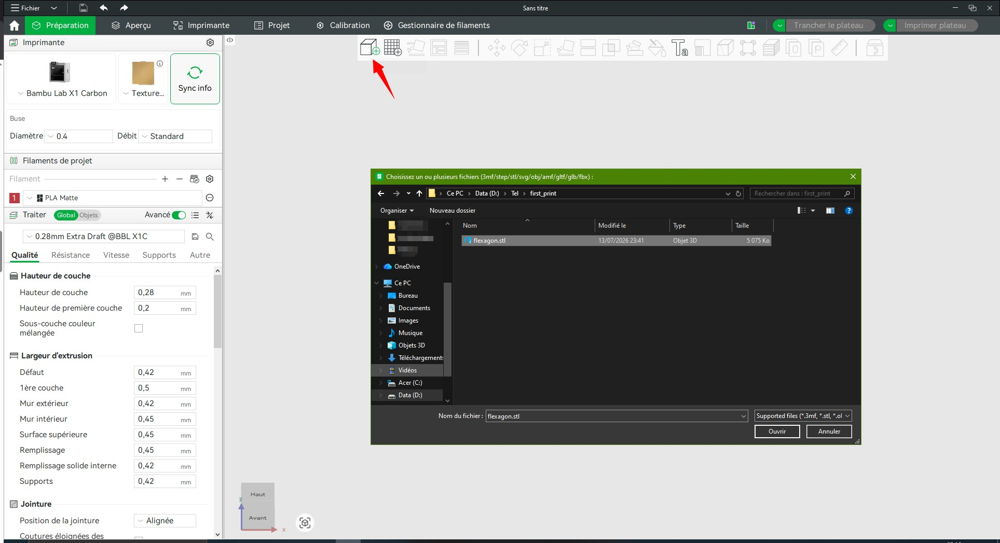

---
 
#### 5. Positionner le modèle sur le plateau

Le modèle n'est pas forcément bien orienté sur le plateau.  
**Cliquer sur la fonction orientation automatique.**  
Il calcule l'orientation qui semble la plus pertinente.  
Si besoin, d'autres outils sont disponibles pour modifier manuellement, la position, l'échelle ou l'orientation du modèle.  

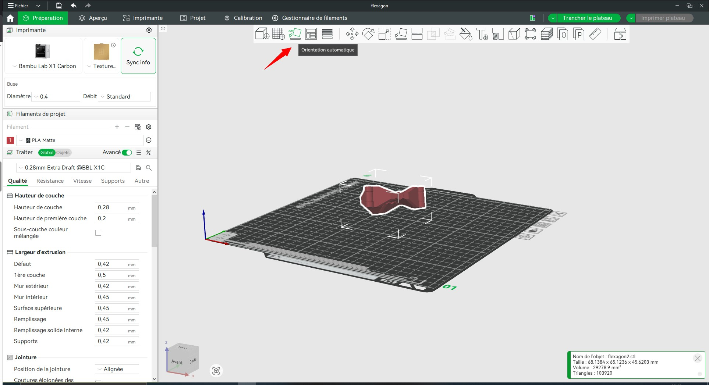

---

#### 6. Paramétrage de l'impression

Vérifier que le filament (matière), est bien du **PLA**  
Sélectionner le profil de paramétrage **0.28mm Extra Draft**

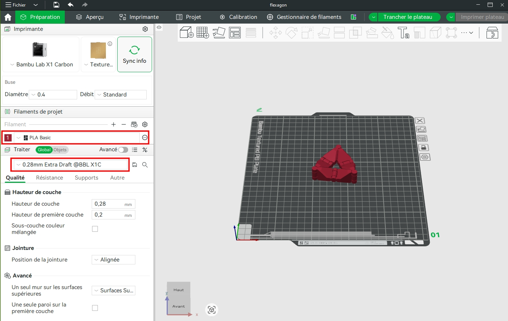

Cliquer sur **Supports** et cocher la case **Activer les supports**  
Puis cliquer sur **Trancher le plateau**

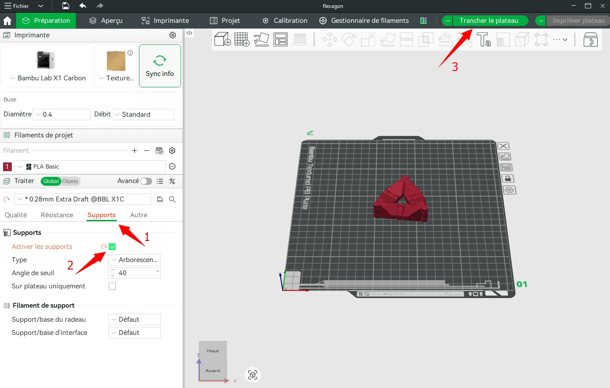

---

#### 7. Aperçu du tranchage
Le slicer vient de calculer les trajectoires d'impression, le temps d'impression et la quantité de filament nécessaire.  
Vous devriez avoir à peu près le même temps d'impression et quantité de matières que ci-dessous.  

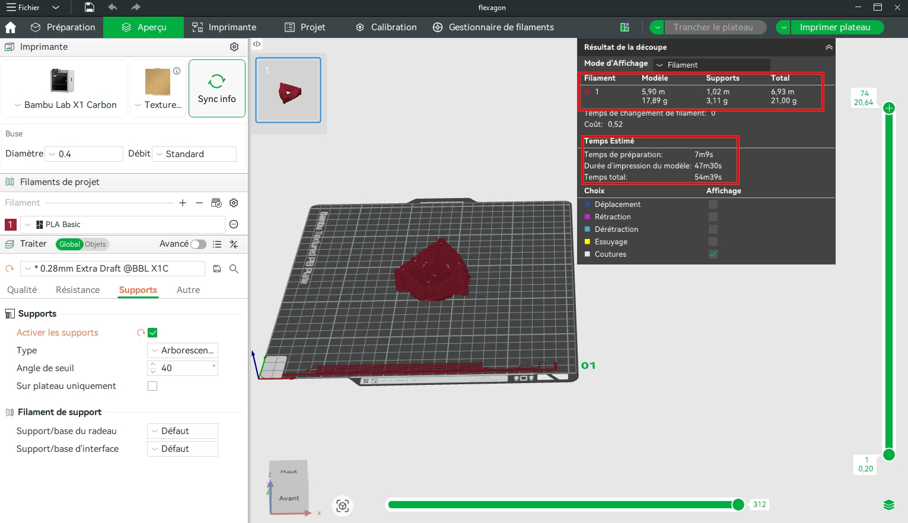

---

#### 8.Exporter le fichier tranché (.3mf)

Cliquer sur la flèche et sélectionner **Exporter le fichier tranché du plateau**.    
Puis cliquez sur le bouton **Exporter le fichier tranché du plateau**  
Enregistrer le fichier .3mf sur votre ordinateur. 

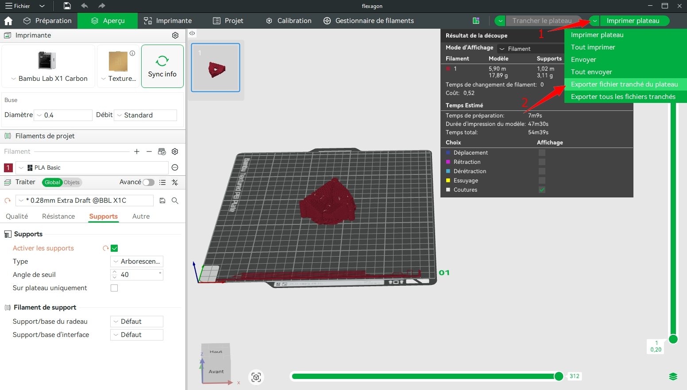

---

## III. 3D Printer OS

L'envoi du fichier à l'imprimante 3D se fait via le serveur 3D Printer OS.

### 1. Création du compte

Créer votre compte sur le site <a href="https://cloud.3dprinteros.com" target="_blank" rel="noopener noreferrer"> 3D Printer OS </a>.  
Utiliser votre adresse mail étudiante. 

### 2. Ajouter les imprimantes (WorkGroup)

Dans 3D Printer OS cliquer sur **Printers** puis sur { align=center width="30" class="off-glb"} et sur **Add workgroup Printers**  
Demander le code d'accès au responsable.

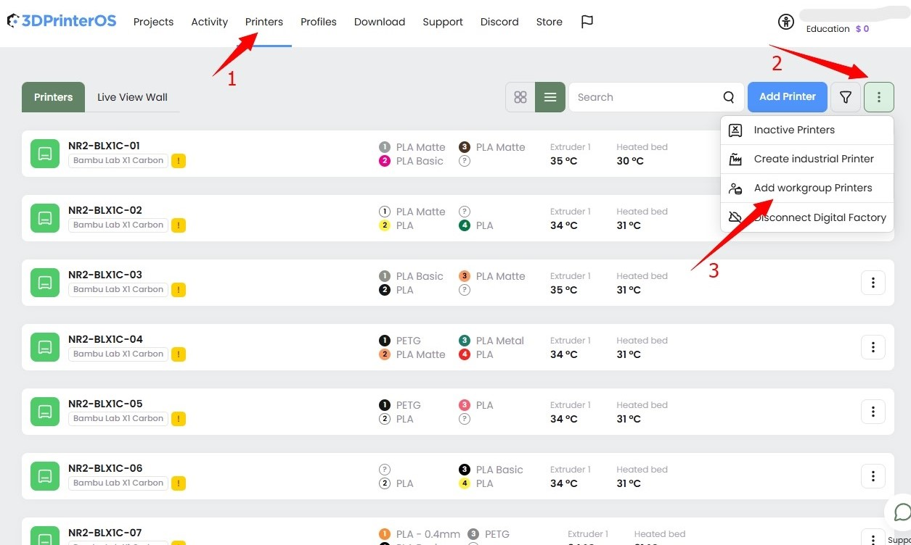

---

### 3. Ajout du fichier d'impression à 3D Printer OS

Dans l'onglet **Projects**, cliquez sur **Add files**.  
Sélectionnez le fichier .3mf, précédemment exporté de Bambu Studio.    

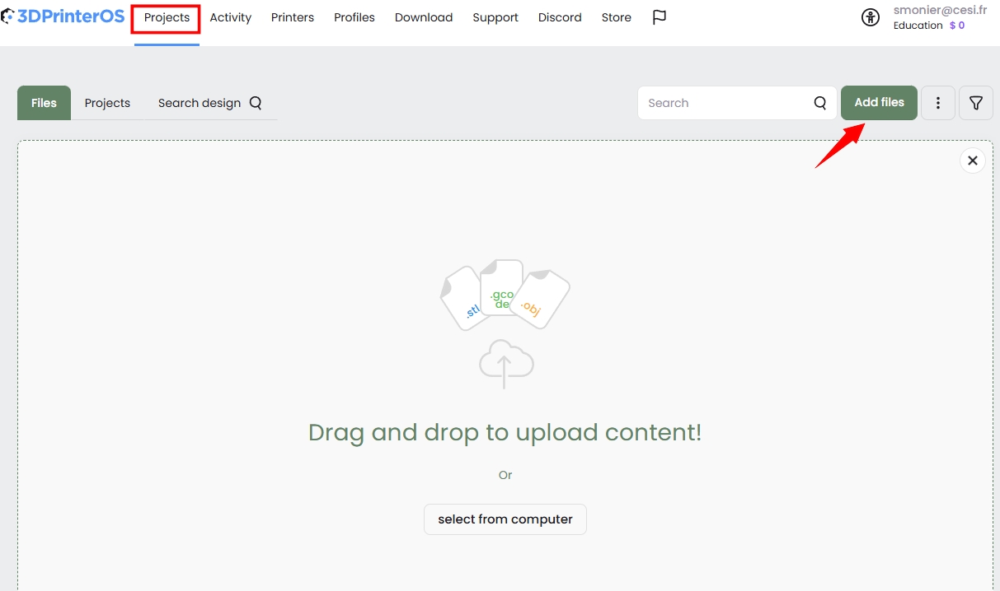

---

### 4. Lancement de l'impression

Après avoir chargé le fichier, cliquez sur **Print**.  

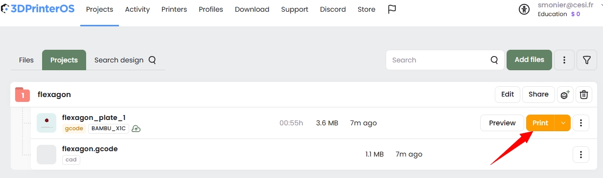

Sélectionner l'imprimante 3D qui vous convient.  
Puis cliquer sur **Queue**

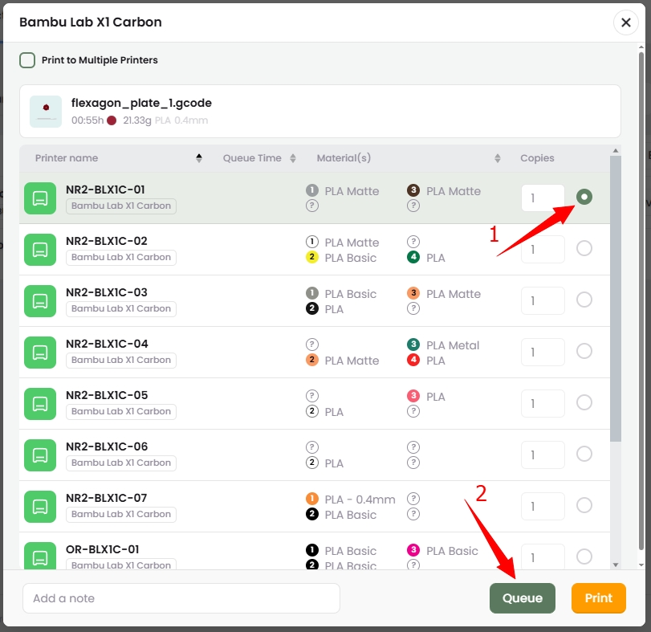 

Sélectionner la matière et la couleur à utiliser.
Puis cliquer sur **Queue**

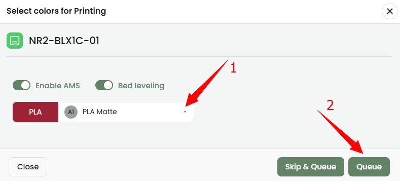

---

## IV. Préparation de l'imprimante 3D

Vérifier sur l'imprimante 3D :

 - [x]  Que le plateau d'impression est vide et sans résidu
 - [x] Que le plateau soit bien positionné  
 - [x] Que rien ne gêne les axes  
 - [x] Que la quantité de filaments est suffisante pour votre impression,  
 *voir onglet aperçu de Bambu Studio* 

 **:warning: Prévenir un responsable pour qu'il puisse valider l'impression et l'envoyer en production. :warning:** 

:warning: **Rester impérativement, pour vérifier les premières couches d'impression.** :warning:  
C'est souvent à ce moment que l'on détecte les problèmes d'impression.
 ---

## V. Récupération de votre impression 3D

Une fois l'impression terminée : 
Ouvrir la porte et décoller les traits de calibration sur le devant du plateau
Puis décoller vos pièces 
Si la pièce a du mal à se décoller demander l'aide d'un responsable.  

Si vous voulez en savoir plus sur l'impression 3D --> [Les bases de l'impression 3D](les-bases-de-limpression-3d.md)