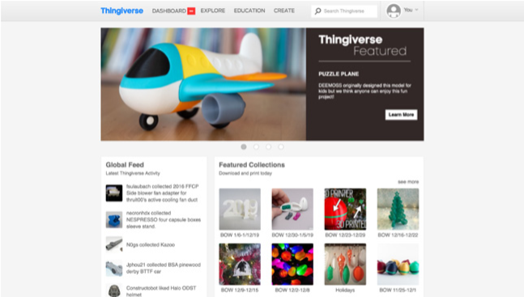
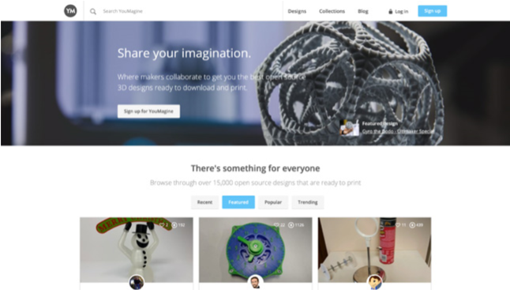
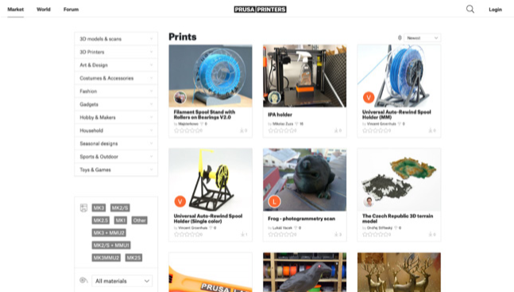
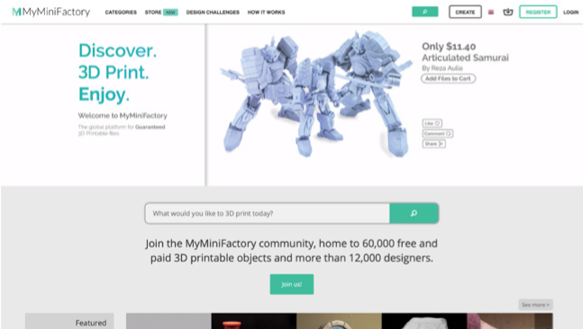
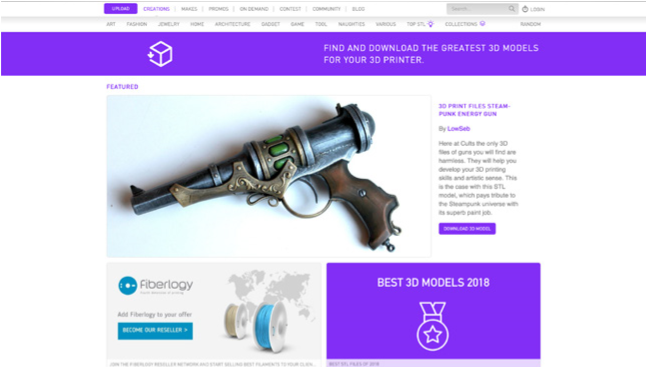
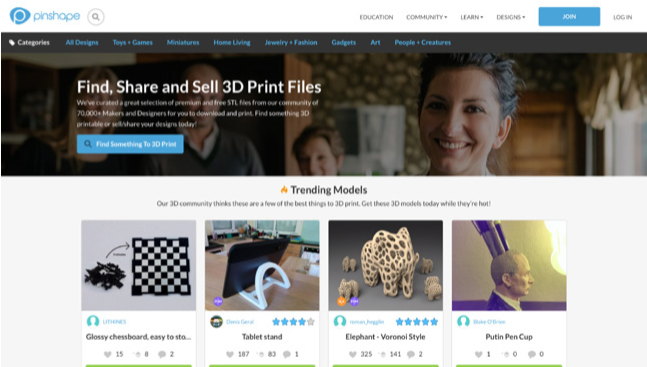
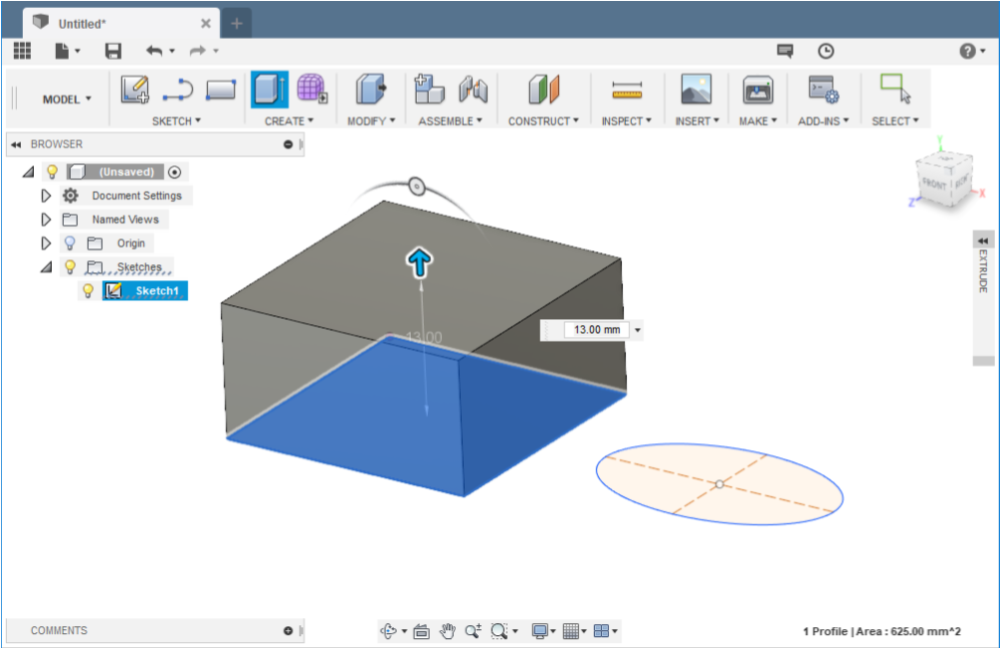
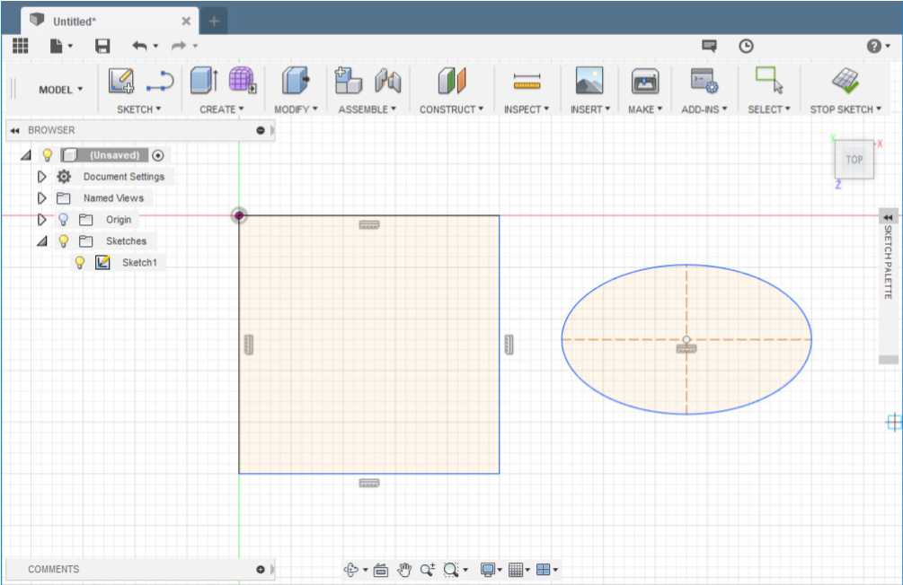
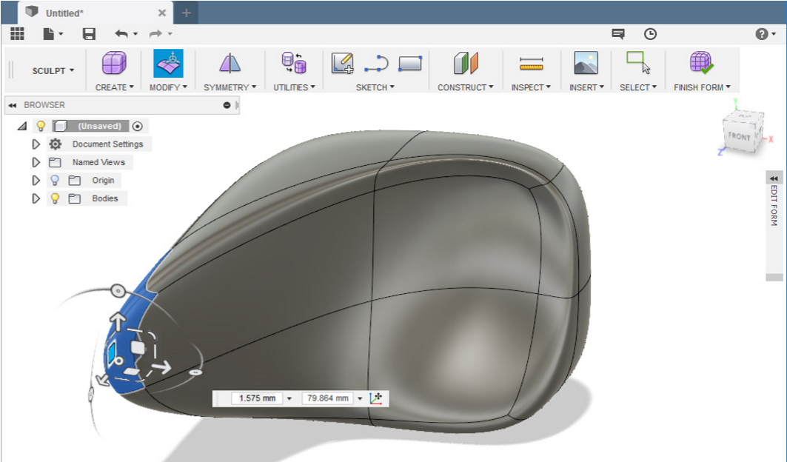
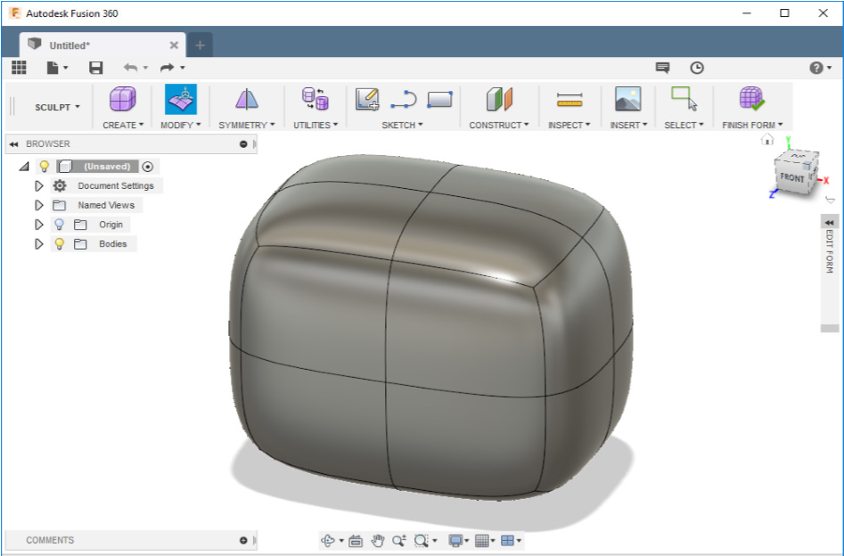

# Les bases de l'impression 3D

Le processus d'impression 3D comprend trois étapes principales. Tout d'abord, vous devez vous procurer un modèle 3D imprimable. Ensuite, vous devez le préparer pour l'impression, et enfin, la dernière étape est le travail d'impression en lui-même. Voyons tout cela sous un angle général. Puis nous nous pencherons sur les détails.

La première étape consiste à obtenir un objet 3D, qui se présente typiquement sous la forme d'un fichier STL. Néanmoins, ce format n'est pas reconnu par les imprimantes 3D et il n'est pas directement imprimable. Pour transformer un fichier STL, vous devez utiliser un outil spécialisé, communément connu sous le nom de slicer (« trancheur »). Il y a différents slicers disponibles sur le marché, certains sont gratuits (PrusaSlicer), d'autres sont payants (Simplify3D) et ils sont habituellement compatibles avec une gamme d'imprimantes limitée, donc vous devez choisir celui qui convient pour votre machine. Vous pouvez importer un fichier STL dans le slicer de votre choix, configurer les paramètres d'impression et exporter le résultat final sous la forme d'un « G-code », qui est concrètement l'objet 3D original découpé en fines couches et converti en une suite de commandes de mouvements reconnue par les imprimantes 3D. De plus, les slicers insèrent des informations additionnelles dans le G-code, comme les informations de température, les paramètres de refroidissement et d'autres choses encore. Le G-code qui en résulte est spécifique à une imprimante, c'est pourquoi les objets 3D sont habituellement partagés sous la forme de fichiers STL — les utilisateurs peuvent ensuite les trancher pour leur imprimante / leur filament individuellement.

Le diagramme ci-dessous décrit les différentes étapes qui rendent possible une impression 3D réussie.

## Se procurer un modèle 3D

En général, vous pouvez obtenir un modèle 3D en utilisant l'un des moyens suivants :

1. **Télécharger un modèle 3D sur internet**
2. **Créer vos propres modèles**
3. **Scanner en 3D des objets réels**

### Consulter les bibliothèques en ligne et 3D hubs

Le moyen le plus facile pour débuter dans l'impression 3D consiste à trouver des objets 3D sur internet gratuitement.
Ils se présentent habituellement sous la forme de fichiers au format .stl ou .obj. 
Il y a beaucoup de sites web offrant une large gamme de modèles à télécharger voir [Ou trouver des models 3D](ou_trouver_des_models_3d.md).

#### PrusaPrinters, Thingiverse, YouMagine

  

**PrusaPrinters** — La plateforme communautaire pour tous les possesseurs d'imprimante Prusa, et la seule bibliothèque en ligne proposant des G-codes pré-découpés et prêts-à-imprimer !

**Thingiverse** — Est l'archive 3D la plus riche sur internet. Actuellement, elle offre plus d'1,2 millions de modèles à télécharger gratuitement — et ce chiffre continue de croître chaque jour. C'est devenu un lieu populaire pour télécharger, partager et mettre en valeur toutes sortes de modèles 3D.

**YouMagine** — Mais c'est tellement plus qu'une bibliothèque de fichiers STL ou 3MF ! Rejoignez-nous maintenant et interagissez avec la communauté de plein de façons différentes !

### Pinshape / MyMiniFactory

**Pinshape** — Le site web offre également des modèles gratuits. Les concepteurs peuvent utiliser ce site web pour vendre leurs propres créations.

**MyMiniFactory** — Les modèles sont testés avant d'être publiés, donc vous pouvez avoir l'assurance que vous obtenez des STLs de haute qualité. Le prix de ces modèles payants est généralement entre 3 et 40€.

YouMagine est un site web communautaire soutenu par Ultimaker. Les modèles sont divisés en catégories populaires ou en collections gérées par les utilisateurs du site. À l'heure actuelle, le portail offre plus de 15 000 modèles à télécharger.

### Cults

  

Modèles gratuits et payants — [www.cults3d.com](https://www.cults3d.com)

Une archive avec plus de 25 000 modèles 3D gratuits et plusieurs milliers de modèles payants. Ce qui fait la différence entre ce site et les autres, ce sont les différentes collections basées sur des marques populaires, comme Lego, IKEA ou GoPro.

## Logiciels de création 3D

De nos jours, vous avez le choix parmi une large gamme d'applications de modélisation 3D. Il y a des applications simples et faciles à utiliser (et souvent en ligne) comme TinkerCad. Vous pouvez essayer la modélisation paramétrique avec OpenSCAD, ou utiliser un outil véritablement professionnel comme le très populaire Autodesk Fusion 360. Toutes ces applications vous permettent de créer un modèle et de l'exporter en tant que fichier STL.

### Tinkercad

Tinkercad est un formidable outil intuitif pour les débutants. Il est gratuit, même s'il est nécessaire de s'enregistrer. Vous pouvez trouver de nombreux tutoriels, des guides ainsi que des conseils en ligne. TinkerCad est construit autour de l'idée d'une bibliothèque de base avec de nombreuses formes, que vous pouvez faire glisser dans la fenêtre principale pour ensuite les modifier. L'application manque de fonctions plus avancées, néanmoins, elle peut importer et éditer un fichier STL déjà existant. Tinkercad est disponible sur [www.tinkercad.com](https://www.tinkercad.com).

### Autodesk Fusion 360

Si vous voulez commencer à modéliser des objets plus complexes, ou bien même différents éléments destinés à s'assembler, alors vous avez besoin d'un outil davantage professionnel. Fusion 360 est une option populaire. Les utilisateurs peuvent travailler à la fois en FAO (Fabrication Assistée par Ordinateur) et CAO (Conception Assistée par Ordinateur), analyse de force ou visualisations. Fusion 360 offre non seulement une possibilité de modélisation paramétrique, mais permet également la sculpture. Penchons-nous sur ces deux méthodes de façon plus détaillée.

**La modélisation paramétrique** est un moyen répandu de créer des modèles structurels ou des pièces mécaniques. L'objet commence en tant que forme 2D utilisant des primitifs basiques (comme une ligne, un carré, un rectangle, un point...). Ensuite l'objet est extrudé, ce qui le transforme en forme 3D.

 

À présent, imaginez que nous voulions créer le modèle d'un chien. L'utilisation de la modélisation paramétrique ne convient pas et ce serait trop compliqué, car nous voulons créer une forme organique. C'est là que la sculpture intervient. La sculpture numérique ressemble un peu à la sculpture dans le monde réel (par exemple en utilisant de la glaise ou un matériau similaire), néanmoins elle a beaucoup d'avantages — comme la fonction annuler. Dans ce cas, les objets primitifs sont déjà des objets 3D — cube, sphère, cylindre, toroïde et autres. Ces objets peuvent être extrudés librement, écrasés, courbés... Référez-vous aux images ci-dessous.

 

Fusion 360 devient aussi de plus en plus populaire parce qu'il est gratuit pour les makers, les innovateurs, les enthousiastes et les entreprises avec un chiffre d'affaires inférieur à 90 000€ par an. Si ce programme a retenu votre attention, alors foncez — c'est un outil formidable avec une communauté très active qui lui est dédiée. En plus, vous pouvez trouver de nombreux tutoriels en ligne. Allez sur [www.autodesk.com/products/fusion-360](https://www.autodesk.com/products/fusion-360) et téléchargez l'application.

### Blender

Blender est probablement le meilleur outil de modélisation 3D gratuit aujourd'hui. Il est développé sous une licence open-source et il est disponible pour Windows, Mac et Linux. Il est peut-être un peu complexe pour un débutant, et même sans doute chaotique. Néanmoins, il a sa place dans le cœur de nombreux utilisateurs. Ceux qui ont des ambitions artistiques, et qui n'ont pas besoin de modélisation paramétrique précise, voient en Blender un formidable outil. Sculpture, texture, animation... Blender fait office de couteau suisse parmi les applications de modélisation 3D.

### OpenSCAD

OpenSCAD est un projet open-source disponible gratuitement sur [www.openscad.org](https://www.openscad.org). Il propose une approche de la modélisation 3D complètement différente — tout est fait en écrivant du code. L'interface utilisateur est divisée en deux parties. Dans la section de gauche, l'utilisateur définit les objets 3D en les « programmant », tandis que dans la section de droite, une prévisualisation 3D apparait. L'application fonctionne essentiellement sur la base de quelques primitives (cube, cylindre, sphère...) et quelques opérations booléennes (joindre, couper, intersection). Néanmoins, le programme permet également de rédiger un script avancé — vous pouvez utiliser les opérateurs les plus connus, tels que « if », « while », « for », les opérateurs logiques et bien d'autres encore. Si vous vous sentez l'âme d'un programmeur plus que celle d'un artiste, vous pouvez essayer OpenSCAD.

Suivez ce lien pour découvrir en détail comment commencer à créer des modèles avec OpenSCAD : [blog.prusaprinters.org/openscad](https://blog.prusaprinters.org/openscad).

Vous pouvez également essayer les applications suivantes :

- Microsoft 3D Builder
- Meshmixer
- Rhinoceros 3D
- FreeCAD
- Autodesk Inventor
- SolidWorks
- Autodesk AutoCAD
- SketchUpd

# Souces

[Prusa](https://www.prusa.com)